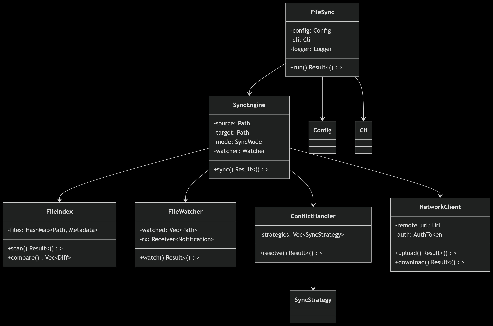

tokio: runtime for writing reliable, asynchronous applications in Rust
walkir: cross platform Rust library for efficiently walking a directory recursively.
clap: A simple to use, efficient, and full-featured Command Line Argument Parser


### Workflow Diagram


```
+---------------------+       +---------------------+       +---------------------+
|      FileSync       |       |     SyncEngine      |       |    NetworkClient    |
+---------------------+       +---------------------+       +---------------------+
| - config: Config    |<>---->| - source: Path      |       | - remote_url: Url   |
| - cli: Cli          |       | - target: Path      |       | - auth: AuthToken   |
| - logger: Logger    |       | - mode: SyncMode    |       +---------------------+
+---------------------+       | - watcher: Watcher  |               ^
       |                      +---------------------+               |
       |                                |                           |
       v                                v                           |
+---------------------+       +---------------------+       +---------------------+
|       Config        |       |     FileIndex       |       |    ConflictHandler  |
+---------------------+       +---------------------+       +---------------------+
| - source: Path      |       | - files: HashMap    |       | - strategies: Vec   |
| - target: Path      |       |   <Path, Metadata>  |       +---------------------+
| - sync_mode: Mode   |       +---------------------+               ^
| - ignore_hidden: bool|              ^                             |
+---------------------+               |                             |
                                      |                             |
+---------------------+       +---------------------+       +---------------------+
|      Metadata       |       |    FileWatcher      |       |    SyncStrategy     |
+---------------------+       +---------------------+       +---------------------+
| - path: Path        |       | - watched: Vec<Path>|       | - name: String      |
| - size: u64         |       | - rx: Receiver      |       | - apply()           |
| - modified: DateTime|       +---------------------+       +---------------------+
| - hash: String      |                  ^
+---------------------+                  |
                                         |
                                 +---------------------+
                                 |    Notification     |
                                 +---------------------+
                                 | - path: Path        |
                                 | - event: EventType  |
                                 +---------------------+
```

ref:



Key Relationships:
1. FileSync orchestrates the main workflow
2. SyncEngine manages core sync logic
3. FileIndex tracks file states
4. FileWatcher monitors filesystem changes
5. ConflictHandler resolves sync conflicts
6. NetworkClient handles remote transfers


### Flowchart Diagram

```
    ┌───────────────────────┐
    │      Start Sync       │
    └──────────┬────────────┘
               ↓
    ┌───────────────────────┐
    │  Parse CLI Arguments  │
    │   & Load Config       │
    └──────────┬────────────┘
               ↓
    ┌───────────────────────┐
    │ Validate Paths &      │
    │  Permissions          │
    └──────────┬────────────┘
               ↓
    ┌───────────────────────┐
    │ Initial Directory Scan│
    │  Build File Index     │
    └──────────┬────────────┘
               ↓
    ┌───────────────────────┐
    │ Start File Watcher    │
    │  (for real-time sync) │◄────────────────────|
    └──────────┬────────────┘                     |              
               ↓                                  |
    ┌───────────────────────┐                     |
    │  Compare Directories  │                     |
    │  (Source vs Target)   │                     |
    └──────────┬────────────┘                     |
               ↓                                  |
    ┌───────────────────────┐                     |
    │  Detect Changes &     │                     |
    │  Conflicts            │                     |
    └──────────┬────────────┘                     |
               |                                  |
               |                                  |
            /─────\                               |
           /       \                              |
          /         \                             |
         /           \                            |
        /  Conflicts? \                           |
        \             /                           |
         \           /                            |
          \         /                             |
      No ──\       /── Yes                        |
       |    \─────/     |                         |
       |                ↓                         |
       |        ┌───────────────────────┐         |
       |        │  Resolve Conflicts    │         |
       |        │  (Apply Strategies)   │         |
       |        └───────┬───────────────┘         |
       ↓                ↓                         |
    ┌───────────────────────┐                     |
    │  Execute File         │                     |
    │  Operations:          │                     |
    │  - Copy               │                     |
    │  - Update             │                     |
    │  - Delete             │                     |
    └──────────┬────────────┘                     |
               ↓                                  |
    ┌───────────────────────┐                     |
    │  Verify Transfers     │                     |
    │  (Checksum Check)     │                     |
    └──────────┬────────────┘                     |
               ↓                                  |
    ┌───────────────────────┐                     |
    │  Update File Index    │                     |
    └──────────┬────────────┘                     |
               ↓                                  |
    ┌───────────────────────┐                     |
    │  Log Results &        │                     |
    │  Statistics           │                     |
    └──────────┬────────────┘                     |
               |                                  |
               ↓                                  |
            /─────\                               |
           /       \                              |
          /         \                             |
         /           \                            |
        / continuous  \                           |
        \             /                           |
         \           /                            |
          \         /                             |
           \       /─────────── Yes ──────────────|
            \─────/              |
               |                 |
               No                |
               |                 |
               ↓                 |
    ┌───────────────────────┐    |
    │  Wait for Next        │────|
    │  Sync Cycle or        │
    │  Real-time Event      │
    └──────────┬────────────┘
               ↓
               ├────────────────┐
               ↓                │
    ┌───────────────────────┐   │
    │   Shutdown on         │   │
    │   Termination Signal  │◄──┘
    └───────────────────────┘
```


### Key Components Explained:

1. Initialization Flow:
    -CLI/config → validation → initial scan
    -Sets up the initial state before syncing

2. Core Sync Loop:
    -Compare → detect changes → resolve conflicts → execute ops
    -Runs continuously for real-time sync or once for batch sync

3. Conflict Resolution:
    -Checks modification times, sizes, hashes
    -Applies configured resolution strategy

4. File Operations:
    Copy new/changed files
    Delete removed files (in mirror mode)
    Update metadata

5. Network Sync Path:
    Additional verification steps
    Chunked transfers for large files
    Connection retry logic